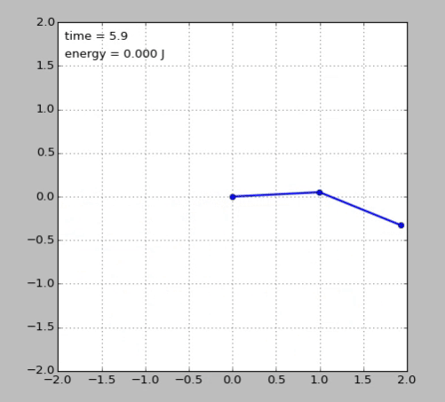
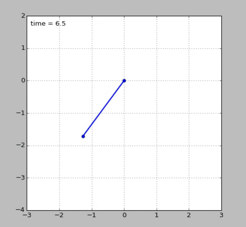
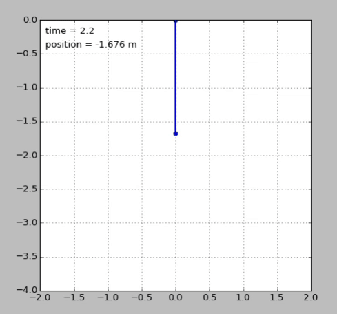

2.003 Simulations
===================================
A set of python simulations to represent the systems solved in 2.003: Dynamics and Control at MIT.

### Double Pendulum

### Mass-Spring Pendulum

### Mass-Spring-Damper System

